# How to install CEPH multinode by Cephadm in Ubuntu 20.04
---
## Table of contents 
[I. Setup](#setup)
- [A. Requirement](#req)
- [B. Setup](#set)           

[II. Bootstrap and setup the CEPH Cluster](#bootstrap)
[III. Demo managing the system storage using CEPH cluster](#demo)

---
 <a name='setup'></a> 
## I. Setup 
 <a name='req'></a> 
### A. Requirement
1. Hardware: Ram > 16GB, Memory > 100GB
2. Software
Vmware Workstation / VirtualBox with 4 virtual machine Ubuntu20.04 (Network Adapter set to NAT)
4 Ubuntu Node:
•	Ceph Admin node: Install Cephadm tool to deploy CEPH
•	CEPH Monitor: Monitoring CEPH
•	2 CEPH OSD: Storage
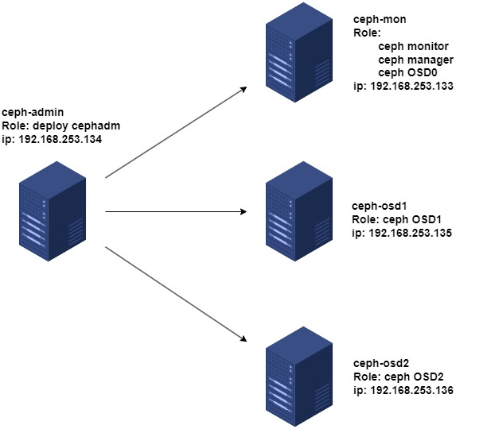

Software will be installed:
•	Python3
•	Systemd
•	Docker
•	Chrony
•	Lvm2


Python3, Systemd are available in ubuntu 20.04.
 <a name='set'></a> 
### B. Set up
Note that these command below should be run with root
Python3, Systemd are available in Ubuntu 20.04
**1. Update system (4 nodes)**
```
# apt update
```

**2. Install lvm2 (4 node)**

```
# apt install lvm2
```

**3. Create empty partitions on nodes to store data (ceph-mon, ceph-osd1, ceph-osd2)**
Before adding a monitor and 2 OSD nodes for storage purposes, it is necessary to create an empty partition on these 3 nodes (this needs to be done on 3 nodes, the following is an example on the monitor node, the other 2 nodes do the same)
- Run ```#lvs``` to view available Logical Volumes (LVs) and Volume Groups (VGs) (currently there are no LVs and VGs).
- Check the hard drive partitions on the server: (here I chose sda1 drive with 510MB capacity)
```
# lvmdiskscan
```
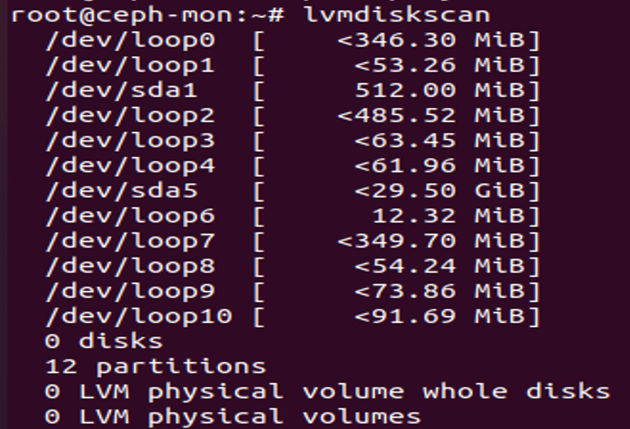

- Umount sda1:
```
# unmount /dev/sda1
# pvcreate /dev/sda1
```
- Create new volume group (vg01) and Logical volume (lv01) (Logical volume has 400MB capacity):
```
# vgcreate vg01 /dev/sda1
# lvcreate -L 400M -n lv01 vg01
```
- Check the status of VG and LV have just been created
```
# lvdisplay
```
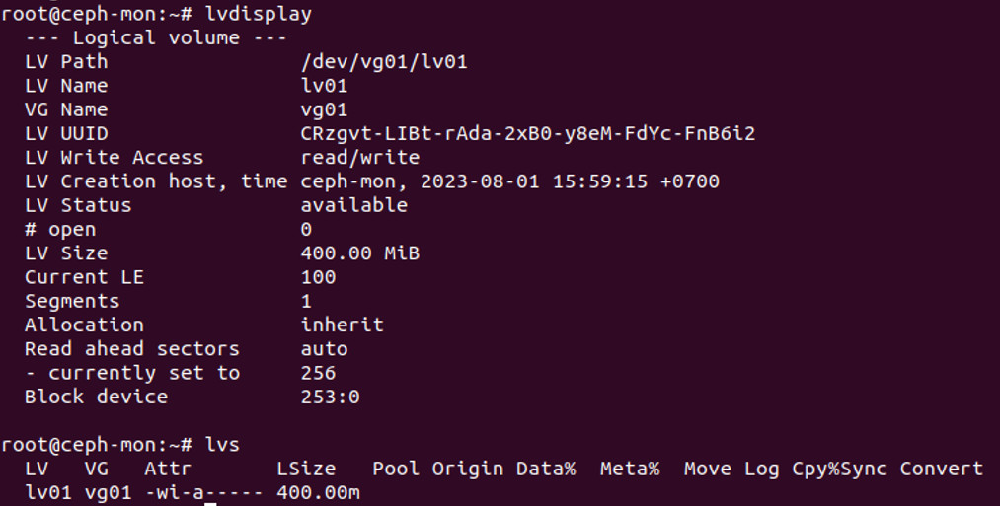
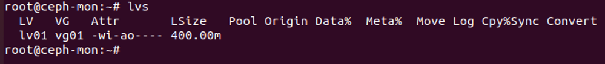

Thus, creating an empty partition on 1 node was successful, the remaining 2 nodes did the same.

**4. Set hostname and update hosts file (4 nodes)**
- Set the hostname of each node with it's function
For instance in admin node:
```
# hostnamectl set-hostname ceph-admin
```
- Set password for root:
```
# passwd root (enter any password)
```
Do the same with the others (ceph-mon, ceph-osd1, ceph-osd2)
- Update hosts file in 4 nodes:
```
# vi /etc/hosts
192.168.253.134 ceph-admin
192.168.253.133 ceph-mon
192.168.253.135 ceph-osd1
192.168.253.136 ceph-osd2
```
**5. Install time synchronized (Chrony) (4 nodes)**
```
# apt install chrony –y
# vim /etc/chrony/chrony.conf
pool ntp.ubuntu.com        iburst maxsources 4
pool 0.ubuntu.pool.ntp.org iburst maxsources 1
pool 1.ubuntu.pool.ntp.org iburst maxsources 1
pool 2.ubuntu.pool.ntp.org iburst maxsources 2
pool 192.168.253.134 iburst
# systemctl restart chronyd
```
**6. Install openssh server (4 nodes)**
```
# apt install openssh-server
# systemctl enable --now sshd
```
**7. Enable root login (4 nodes)**
```
#vim /etc/ssh/sshd_config
```
- Add this (line 35):
```
PermitRootLogin yes
```
- Reload openssh-server
```
# systemctl reload sshd
```
**8. Create Ceph deployment user (ceph-admin)**
```
# useradd -m -s /bin/bash cephadmin
# passwd cephadmin
# echo "cephadmin ALL=(ALL:ALL) NOPASSWD:ALL" >> /etc/sudoers.d/cephadmin
# chmod 0440 /etc/sudoers.d/cephadmin
```
**9. Install docker (4 nodes)**
```
# sudo apt install apt-transport-https ca-certificates curl gnupg-agent software-properties-common -y
curl -fsSL https://download.docker.com/linux/ubuntu/gpg | sudo apt-key add -
echo "deb [arch=amd64] https://download.docker.com/linux/ubuntu $(lsb_release -sc) stable" | sudo tee /etc/apt/sources.list.d/docker-ce.list
# sudo apt update
# sudo apt install docker-ce docker-ce-cli containerd.io -y
# Sudo systemctl enable --now docker
```

##II. Bootstrap and setup the CEPH Cluster
After install the necessary software, proceed to create the CEPH cluster.
**1. Install cephadm (ceph-admin)**
```
# sudo wget –q https://github.com/ceph/ceph/raw/pacific/src/cephadm/cephadm -P /usr/bin/
# sudo chmod +x /usr/bin/cephadm
# su – cephadmin
# whoami
Output: cephadmin
```
**2. Bootstrap CEPH cluster**
On ceph-admin node:
```
# sudo cephadm bootstrap --mon-ip 192.168.253.134
```
Bootstrap is successful, the terminal will return the path and information about the account and password for the user to log in to the newly created Ceph Dashboard.
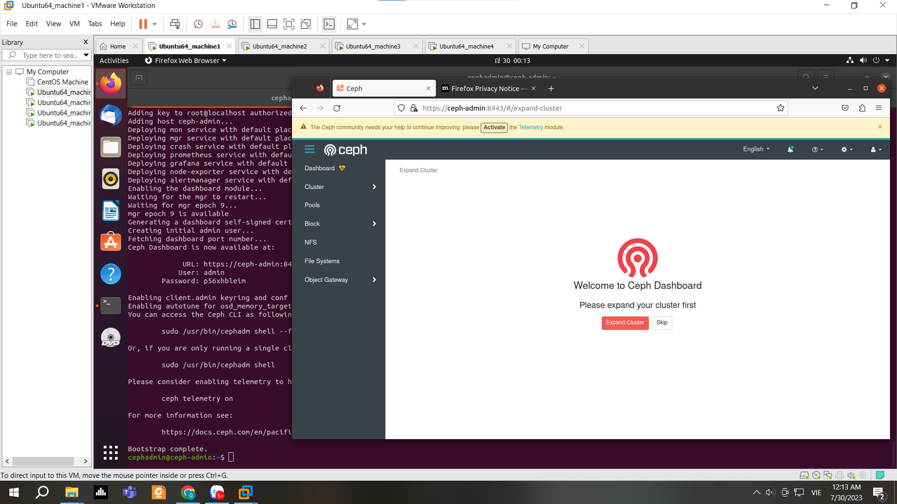
**3. Enable Ceph CLI**
There are several ways to access Ceph CLI.
The first way to use the CEPH CLI command, users can use the cephadm command, for example:
```
# sudo cephadm shell – ceph <command>
```
Example to view cluster status:
```
# sudo cephadm shell – ceph -s
```
Or users can download CEPH CLI tools on the host they need to use:
```
# sudo cephadm add-repo --release pacific
# sudo cephadm install ceph-common
```
By this way, User can use CEPH CLI simply with: 
```
# sudo ceph <command>
```
With the command to view ceph cluster status just created, it can be seen that there is only 1 monitor node on the ceph cluster. Next, we will proceed to add the remaining nodes.
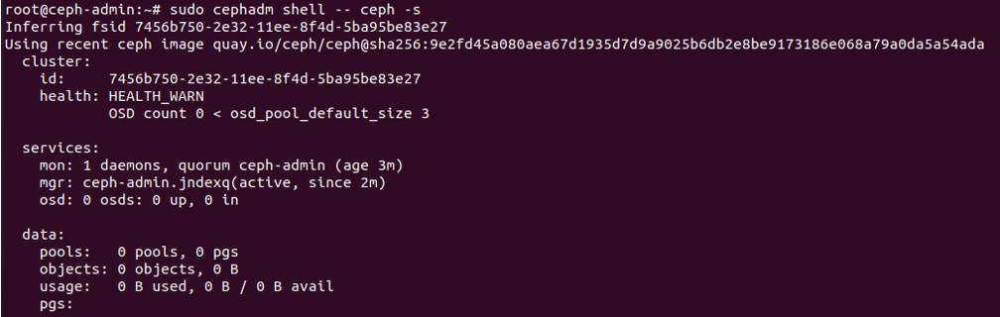

**4. Add Monitor node and 2 OSD Nodes**
- Add monitor Node:
```
# ssh-copy-id -f -i /etc/ceph/ceph.pub root@ceph-mon
# sudo cephadm shell -- ceph orch host add ceph-mon
# sudo cephadm shell -- ceph orch host label add ceph-mon mon/osd
```
- Add osd1:
```
# sudo ssh-copy-id -f -i /etc/ceph/ceph.pub root@ceph-osd1
# sudo cephadm shell -- ceph orch host add ceph-osd1
# sudo cephadm shell -- ceph orch host label add ceph-osd1 osd
```
- Add osd2:
```
# sudo ssh-copy-id -f -i /etc/ceph/ceph.pub root@ceph-osd2
# sudo cephadm shell -- ceph orch host add ceph-osd2
# sudo cephadm shell -- ceph orch host label add ceph-osd2 osd
```
- Check nodes list (3 nodes have been successfully added)
 ```
 # sudo cephadm shell -- ceph orch host ls
 ```
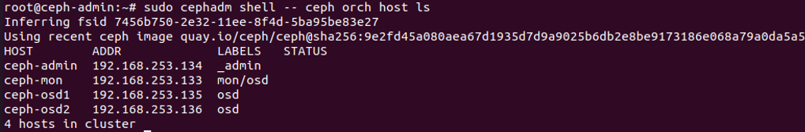

- Assign logical volumes to the OSD to use as backstores for OSD daemons:
```
# sudo cephadm shell -- ceph orch daemon add osd ceph-mon:vg01/lv01
# sudo cephadm shell -- ceph orch daemon add osd ceph-osd1:vg01/lv01
# sudo cephadm shell -- ceph orch daemon add osd ceph-osd2:vg01/lv01
```
**5. Build successfully, check and confirm cluster health**
```
# cephadm shell -- ceph -s
```
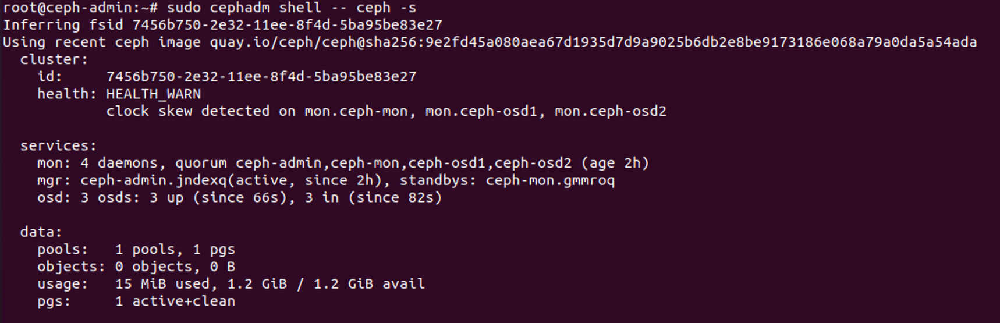
There are 4 daemon, 3 node osds have been successfully added.
Ceph dashboard:
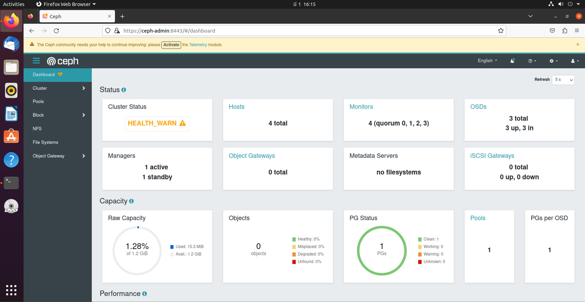
There are 4 hosts: cephadm, monitor and 2 osd.
The 3 newly added OSDs are also displayed in the dashboard, so the system works according to the setup.
Monitor: Shows information about hosts (host name, ip address) and cluster status information.
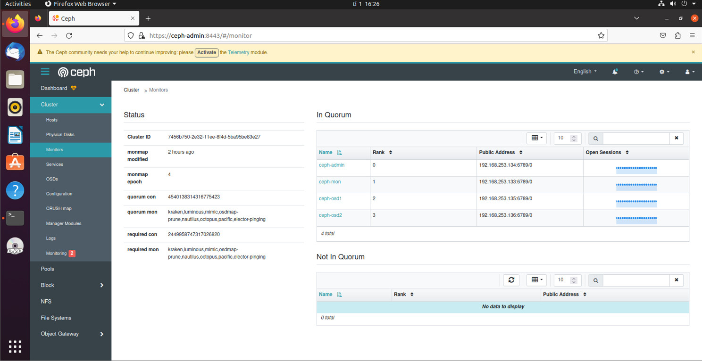
OSD: displays information about OSDs (name, status, storage capacity, available capacity)
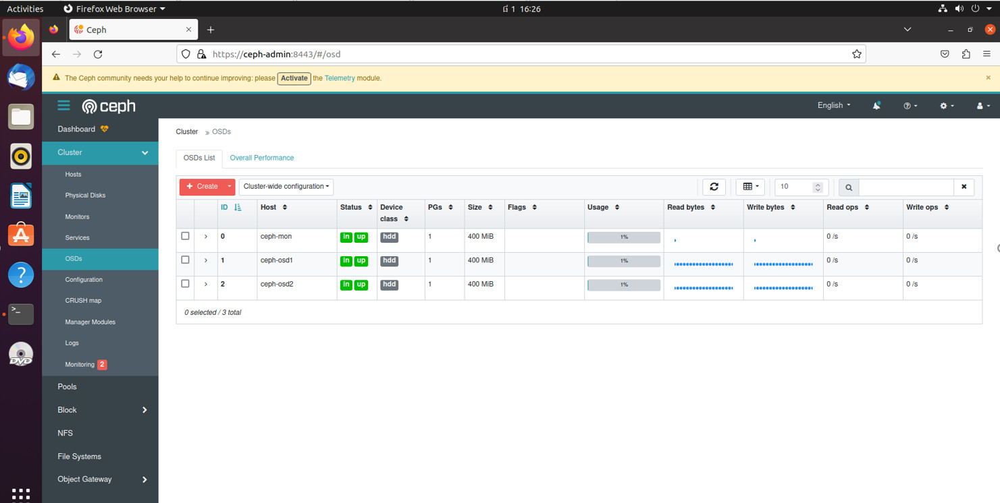

##III. Demo managing the system storage using CEPH cluster.

**1. Create pool**
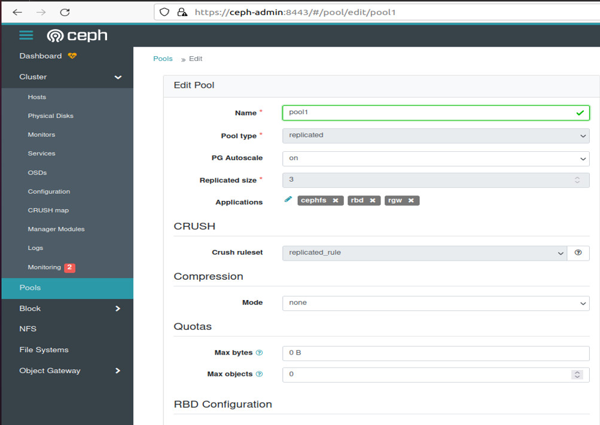

Check pool informantion:
```
# cephadm shell -- ceph osd pool ls detail
```
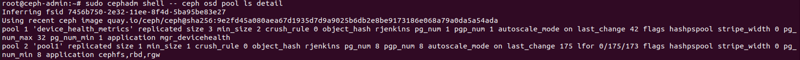

**2. Create file image to store data**
Ceph provides RBD commands to manage block device images. We can create a new image, resize, create snapshots and export block devices with the rbd command:
- Create a new image named disk01, 100mb capacity in pool1 just created:
```
# rbd create disk01 --size 100 -p pool1
```
disk01 avaiable in pool1:
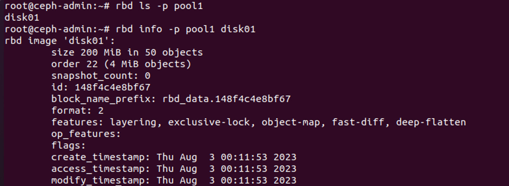
- Active rbd kernel module:
```
# modprobe rbd – p pool1
# rbd feature disable disk01 exclusive-lock object-map fast-diff deep-flatten -p pool1
```
- Map disk01 image to block device through rbd kernel module:
```
# rbd map disk01 -p pool1
```
- Format disk01:
```
# sudo mkfs.xfs /dev/rbd0
```
- Mount dev/rbd0 to mnt directory:
```
# mkdir -p /mnt/mydisk
# mount /dev/rbd0 /mnt/mydisk
```
Ceph block device is available in the client's disk filesystem:
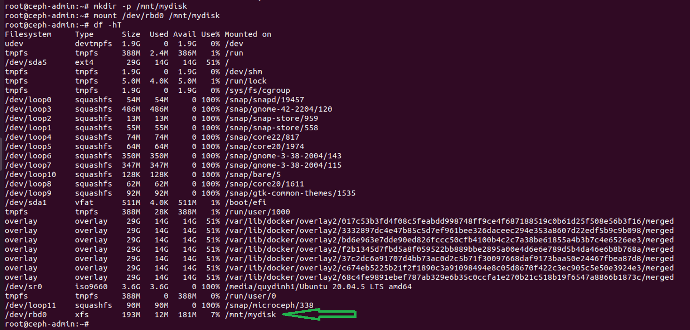
In the server, the newly created images can be used to store data on the server as usual:
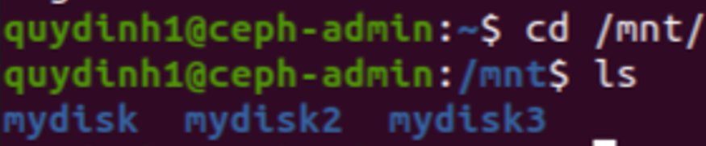
In CEPH's interface, you can see the images that have been created and are managed by Ceph:
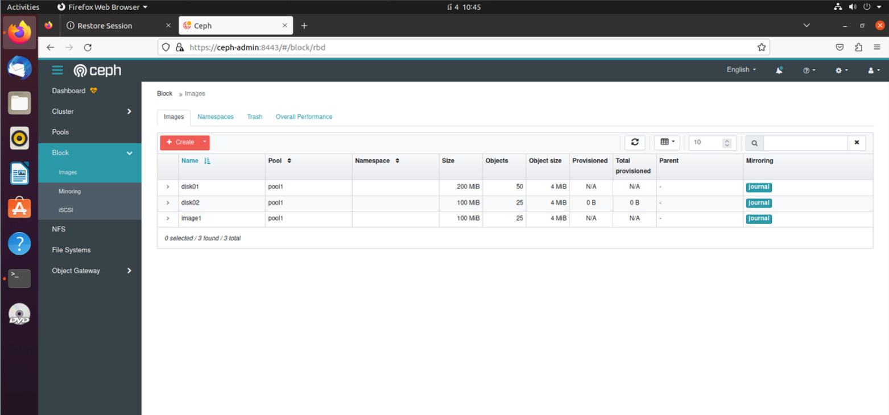


